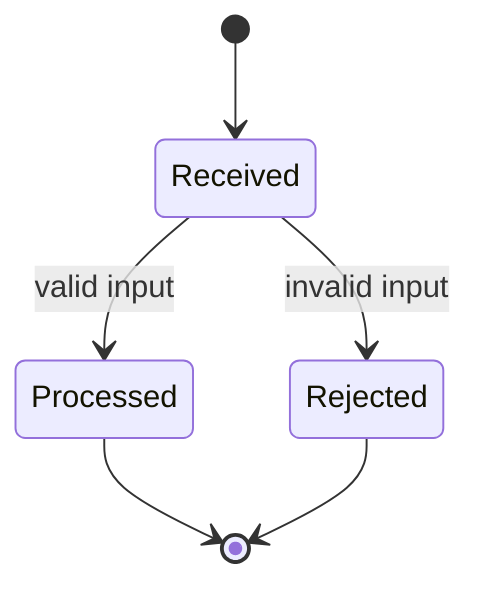
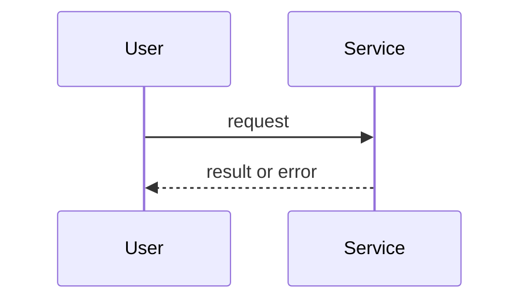

# Managed workflow plan

Turn a requested repository change into an approved design and a persistent implementation plan.
Planning is read-only until the user explicitly approves writing the plan artifact. Do not implement,
commit, or change Git metadata.

The workflow order is fixed:

`PLAN -> EXECUTE one task -> test -> VERIFY that task -> next task`

After every task is `[X][V]` or `[X][R]`, `managed-workflow-complete` performs the final whole-plan
check and writes the Completion Summary.

Every implementation task must appear in the plan and receive separate execution and verification
status. Scope classification changes the depth of planning, never the execution and verification
gates.

## Design process

1. Inspect the request, repository instructions, current Git state, the controlling implementation,
   and the nearest relevant test or call site without changing files. State the intended outcome,
   users, success criteria, constraints, assumptions, and non-goals. Distinguish requirements from
   assumptions.
2. Classify the work and state the classification so the user can correct it:
   - **Spike:** a feasibility question whose output is a recommendation, not production code.
   - **Bounded:** a focused change to an existing behavior or flow.
   - **Architectural:** a new subsystem, cross-boundary interface, or structural change.
3. Ask only questions that resolve material uncertainty. Do not ask for information already present
   in the request or repository. Prefer one focused question at a time.
4. For a meaningful design choice, lead with the recommended approach, then describe up to two
   alternatives and their trade-offs. Do not invent alternatives for an obvious local change.
5. Present a design proportional to the classification:
   - Spike: the question, probe, evidence needed, and stopping condition.
   - Bounded: a short design covering behavior, affected files or interfaces, and testing.
   - Architectural: scope, components, interfaces, data flow, error handling, testing, risks, and
     likely failure modes.
6. End with a direct approval question. Stop there. Do not draft or write an implementation plan
   before design approval. Reuse explicit approval already given; do not ask twice.

Start exploration from one concrete anchor and follow only the path that controls the behavior.
Take another read only when it can distinguish between plausible designs or identify a focused test.
Do not map unrelated repository surfaces.

A spike ends with findings and a recommendation. Bounded and architectural changes continue to an
implementation plan after design approval. Hidden complexity upgrades bounded work to architectural;
stop and obtain approval for the revised design rather than silently expanding scope.

Do not commit a design or plan. Obtain explicit user approval before writing or overwriting either
artifact. For a change that needs a separate design document, save the approved design as
`docs/plans/YYYY-MM-DD_HH_MM_<topic>-design.md`. Save the corresponding implementation plan with
that timestamp and topic as `docs/plans/YYYY-MM-DD_HH_MM_<topic>-plan.md`. Otherwise save only the
approved plan with the same plan naming pattern.

For bounded work, the approved in-chat design is sufficient, but the persistent plan is still
required before `managed-workflow-execute` begins. After writing any plan and passing the plan format
gate, request explicit implementation approval. Planning approval is not implementation approval.
When the user grants implementation approval, invoke `managed-workflow-execute` for that plan; it
runs the remaining tasks, their verification, and completion.

When the user supplies an existing plan for formatting only, preserve every substantive statement.
Change only Markdown structure and progress tracking unless the user separately approves content
changes.

## Task sizing

Each task delivers one observable behavior or one independently verifiable enabling capability. A
task is correctly sized when an implementer can understand it from the task plus global constraints,
change it without unrelated repository exploration, and prove it with focused verification.

Prefer tasks that:

- have one goal and one cohesive acceptance boundary;
- touch a small set of tightly related files, without treating file count as a hard limit;
- contain at most seven numbered implementation steps, usually three to seven and fewer for a
  truly mechanical change; split any task that needs more;
- name one focused verification command and its expected result;
- define the inputs they consume and the interface or behavior they produce; and
- include relevant negative and boundary behavior.

Split a task when it combines independent behaviors, crosses boundaries that can be verified
separately, needs unrelated verification strategies, contains an unresolved design choice, or cannot
be summarized without joining goals with "and". Prefer vertical, working slices over file-layer
tasks. Do not split tiny same-shape edits that share one behavior and one verification surface.

If correct completion depends on a later task, either combine the work into one cohesive task or
redefine the first task around an independently testable contract. Never create a task that can only
be declared correct by assumption.

## Required plan content

The plan must contain:

- the goal, architecture, technology stack, and explicit scope;
- process diagrams that explain the implemented behavior before any task details;
- exact files expected to change;
- ordered implementation steps sized by the task rules above;
- tests and other verification commands;
- plan-level acceptance criteria and one justified final integration command;
- risks, assumptions, and likely failure modes; and
- measurable acceptance criteria.

For each task, identify the cheapest focused test that can disprove its behavior, including relevant
negative and boundary cases. Use test-first ordering for bug fixes and behavior changes. Do not force
a failing-test ceremony for documentation or non-behavioral mechanical changes. Specify a broader
suite only at a justified integration point or final task, and state what risk it covers.

Keep the plan as a coordination artifact, not a source-code copy. Reference exact files, symbols,
interfaces, commands, and expected behavior. Include code only when an exact literal or signature is
part of the contract. Do not paste repository history, long command output, or implementation code
that the executor can read locally.

Use capability-oriented language and do not assume particular tool names. Label unproven
observations as indications, reserve findings for evidence-backed issues, and call results verified
only when supported by real command output.

## Process diagrams

The `## Process Diagrams` section explains, before any task, the process the plan implements, not
this workflow. Provide two Mermaid diagrams:

- a `stateDiagram-v2` of the lifecycle states and transitions of the main entity or process,
  including error and terminal states; and
- a `sequenceDiagram` of the interactions between actors, components, and external systems in the
  main flow, including the key failure path when relevant.

Keep each diagram to about fifteen states or messages, consistent with the scope, interfaces, and
tasks. Use plain identifiers and quote labels that contain punctuation. When a diagram adds no
understanding, such as a stateless formatting change or a single-component edit, replace it with
`**State chart:** Not applicable - <reason>` or `**Sequence diagram:** Not applicable - <reason>`.
For architectural work, include the same diagrams in the design presentation for review.

## Mandatory progress format

Every plan must contain a `## Progress` section before task details. It is the sole progress index.
Every detailed task must have exactly one matching progress entry:

```markdown
## Progress

- [ ][ ] Task 1: short description
- [ ][ ] Task 2: short description
```

The first checkbox is execution status and is owned by `managed-workflow-execute`:

- `[ ]` means not executed;
- `[X]` means executed.

The second checkbox is verification status and is owned by `managed-workflow-verify`:

- `[ ]` means not verified;
- `[V]` means verified clean;
- `[F]` means verification found defects and remediation is required;
- `[R]` means re-verified clean after remediation.

Initialize every new task as `[ ][ ]`. Progress descriptions must be under 80 characters. The
planner never pre-fills either column.

## Persistent evidence

Every plan must contain an append-only `## Evidence Log` and a `## Completion Summary`. Evidence
survives context compaction and lets later stages resume without replaying the conversation or long
command output.

Write exactly one concise evidence entry for each state transition. Keep each entry to one Markdown
line and at most 240 characters. Record the task, stage, command or check, exit code, result count,
status, and only the decision or residual risk needed later. Never paste full output, stack traces,
diffs, repository history, or repeated successful results.

Use these forms:

```markdown
- Task 1 EXECUTE: `<focused command>` -> exit 0, 8 passed; acceptance met
- Task 1 VERIFY: `<focused command>` -> exit 0, 8 passed; [V], residual risk: none
- Task 2 REMEDIATION: HIGH finding at `path:line` addressed; `<command>` -> exit 0
- Task 2 REVERIFY: original findings resolved; `<command>` -> exit 0; [R]
- FINAL: `<broad command>` -> exit 0, 42 passed; acceptance met
```

The planner creates the empty sections. The executor appends only `EXECUTE` and `REMEDIATION`
entries; the verifier appends only `VERIFY` and `REVERIFY` entries; the completer appends only
`FINAL` entries and replaces the pending completion summary. No stage edits or deletes prior
evidence. Consumers read only global constraints, the selected task, and evidence entries relevant
to that task; the completer reads the full compact log once.

## Plan format gate

The plan format is a contract for the executor, verifier, and completer. Copy the structure below
exactly, filling every placeholder; keep the section order, headings, field labels, and checkbox
syntax unchanged. Optional overview sections may appear only before `## Process Diagrams`.

After writing or repairing a plan, run this skill's bundled validator with Python 3 (`python3`, or
`python` where it is Python 3):

`python3 <this-skill-folder>/scripts/validate_plan.py --new <plan-path>`

Omit `--new` when repairing a plan that already has progress or evidence. On
`PLAN_FORMAT_INVALID`, fix every reported line and rerun until it prints `PLAN_FORMAT_OK`. Report a
plan as ready only after `PLAN_FORMAT_OK`, and include that line in the response. If Python is
unavailable, state that the plan is unvalidated; never claim validation without the output.

## Required plan structure

````markdown
# <Feature Name> Implementation Plan

**Goal:** <one sentence>
**Architecture:** <two or three sentences>
**Tech Stack:** <key technologies>

## Scope

<in-scope and out-of-scope work>

## Plan Acceptance

- <measurable end-to-end result>

## Final Verification

- `<broad command>` covers <integration or shared-code risk>

## Process Diagrams





## Progress

- [ ][ ] Task 1: <short description>

## Evidence Log

<!-- Append-only. One concise line per state transition. -->

## Completion Summary

**Status:** Pending

---

### Task 1: <short description>

**Files:**

- Create: `exact/path`
- Modify: `exact/path`

**Inputs:**

- <existing interface or output from an earlier task>

**Implementation steps:**

1. <step>

**Verification:**

- `<command>`

**Acceptance criteria:**

- <measurable result>

**Produces:**

- <interface or behavior available to later tasks>

## Risks, Assumptions, and Likely Failure Modes

- <item>
````

Each task must be independently implementable and verifiable. Every task detail heading and Progress
entry must use the same task number and short description. Order tasks so each consumes only explicit
outputs from completed predecessors.

For an explicit discovery check, reply with exactly
`CODEX_SKILL_DISCOVERY_managed-workflow-plan` and nothing else.
